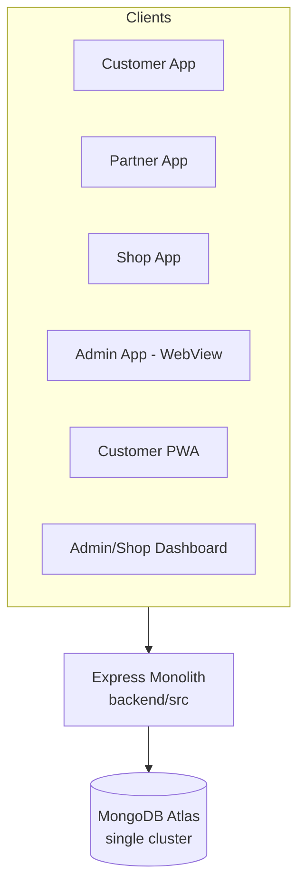
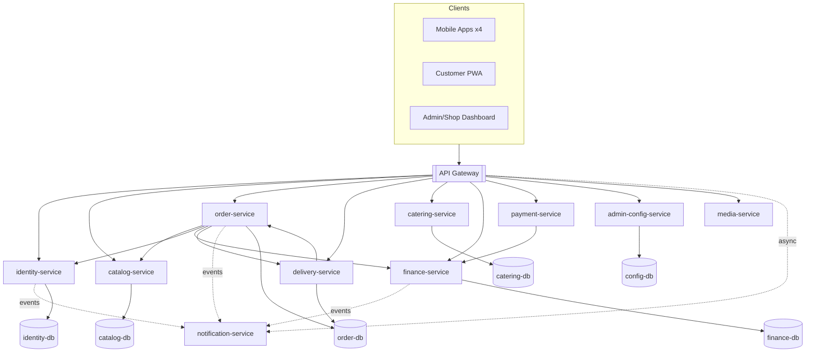
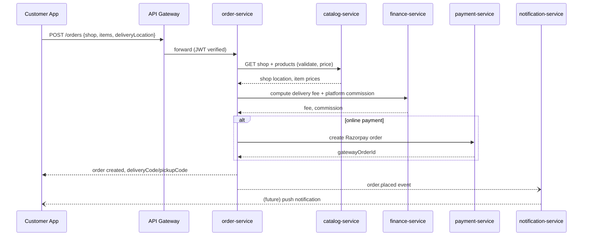
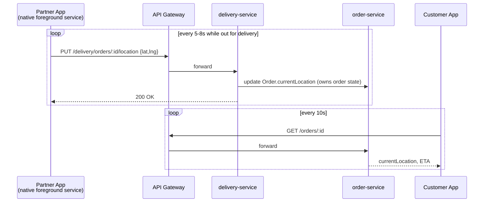
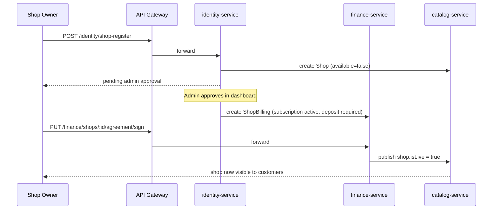
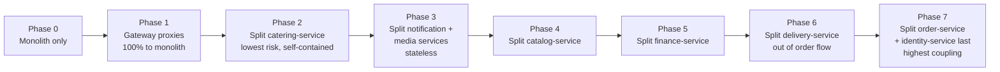
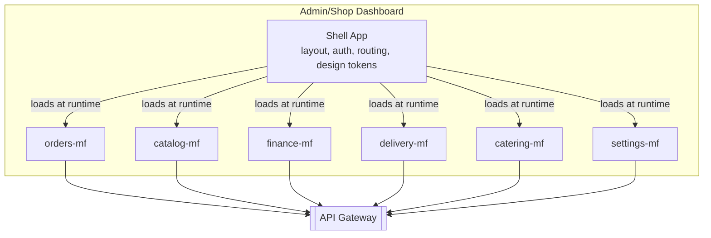

# Munchbox — Target Microservices & Micro-Frontend Architecture

This document is the target-state design for decomposing the current Munchbox monolith
into independently deployable backend services and frontend modules. It lives alongside
the working monolith — nothing here changes how the app runs today. See
[`microservices/`](microservices/) and [`microfrontends/`](microfrontends/) for the
scaffolded folders this document describes.

## 1. Current state (as of this document)

One Express app (`backend/`) serves all four mobile apps (Customer, Partner, Shop, Admin),
the customer PWA, and the admin/shop web dashboard, backed by one MongoDB Atlas cluster.



Everything — auth, shops, products, orders, delivery tracking, catering, ledger/finance,
payments, settings, uploads — lives in one process, one deploy, one set of route files.
That's appropriate for the current scale (~11 shops, one operator) and is why splitting
it up is a deliberate future-facing investment, not a fix for a current problem.

## 2. Domain map of the existing monolith

Mapping every current route to the domain it actually belongs to (this is the seam the
service boundaries below are cut along):

| Domain | Current routes | Current models | Notes |
|---|---|---|---|
| **Identity** | `/api/auth/register`, `/login`, `/verify-2fa`, `/shop-register`, `/shop-2fa/*`, `/request-otp`, `/verify-otp`, `/reset-password`, `/me`, `/delivery-register`, `/kyc`, `/delivery-accounts/*`, `/shop-accounts/*` | `User`, `Otp` | Today this single route file also carries ledger and account-approval endpoints — a real boundary violation worth fixing on the way in. |
| **Catalog** | `/api/shops/*`, `/api/products/*` | `Shop`, `Product`, `Coupon` | Shop's `subscription`/`deposit`/`agreement` sub-documents are really Finance's concern (see §4). |
| **Orders** | `/api/orders/*` (place, courier, status, pickup/deliver, rate, cancel, messages, eta) | `Order`, `Message` | The biggest, most central service — everything else is a dependency of it. |
| **Delivery** | `/api/orders/available`, `/assigned`, `/work-area`, `/:id/location`, `/:id/claim` | *(fields on `Order` + `User.kyc`)* | Logically distinct from order lifecycle, physically entangled in `orderController.js` today. |
| **Catering** | `/api/catering/*` | `CateringRequest` | Self-contained already — lowest-risk first split. |
| **Finance** | `/api/finance/*`, `/api/auth/ledger*`, `/api/payments/failures`, `/api/payments/upi/*` | `LedgerEntry`, `Expense`, `PaymentFailure` | Wallet balance is derived by summing `LedgerEntry` — a real "eventually consistent read model" once this is its own service. |
| **Payments** | `/api/payments/razorpay/*` | *(none owned)* | Thin integration layer over Razorpay; writes land in Finance. |
| **Config/Admin** | `/api/settings/*` | `Settings` | App versions/APK publish, SMS + Razorpay credentials, shop agreement template. |
| **Media** | `/api/uploads/*` | *(files on disk)* | Images, KYC docs, APKs. |
| **Notifications** | *(no dedicated routes — inline in authController)* | *(none)* | SMS/OTP delivery today is a function call inside identity; becomes its own service so any domain can trigger a notification without importing identity's internals. |

## 3. Target service map



**Deliberate, pragmatic deviation from "pure" microservices:** true database-per-service
means separate MongoDB clusters/databases, which costs real money on Atlas and is
overkill before there's an actual scaling reason. Phase 1–2 (see §6) run every service
against **separate databases on the same Atlas cluster** (not separate collections in one
DB — that's still a shared-database anti-pattern) so ownership is real and enforced at
the connection-string level, and clusters can be split apart later with zero application
code changes.

### 3.1 Service responsibilities

| Service | Owns | Depends on | Why it's its own service |
|---|---|---|---|
| **identity-service** | `User`, `Otp`, sessions/JWT | notification-service (send OTP) | Every other service needs "who is this token" — must be the most stable, independently-scalable service. |
| **catalog-service** | `Shop`, `Product`, `Coupon` | — | Read-heavy, publicly browsable, different scaling profile from write-heavy order flow. |
| **order-service** | `Order`, `Message` | catalog, identity, finance, delivery | The core transactional workflow; kept separate from delivery so a partner-matching redesign doesn't touch order state machine code. |
| **delivery-service** | `DeliveryAssignment`, `PartnerLocation` *(new — split out of `Order`)* | order-service | Live GPS writes are high-frequency and bursty (every 5-8s per active delivery) — isolating them means a tracking-service outage never blocks placing new orders. |
| **catering-service** | `CateringRequest` | catalog (shop lookup) | Fully self-contained today; zero shared state with orders. Recommended **first real split** (§6). |
| **finance-service** | `LedgerEntry`, `Expense`, `PaymentFailure`, shop `subscription`/`deposit`/`agreement` | — | Money-movement logic (commission, deposits, wallet balance) benefits from being the one place that can freeze/audit itself independently of everything else. |
| **payment-service** | *(none — integration layer)* | finance-service | Isolates the Razorpay SDK/webhook surface so a gateway credential rotation or provider swap never touches order or finance code. |
| **notification-service** | *(none — integration layer)* | — | SMS/push provider swaps (the Fast2SMS DLT saga this project already lived through) become a one-service change. |
| **admin-config-service** | `Settings` | — | App-version/APK publish and platform-wide config change far less often than everything else; no reason to redeploy it alongside order-service. |
| **media-service** | uploaded files | — | Stateless, horizontally scalable independently of business logic; candidate to move to S3/Cloudinary later without touching any other service. |
| **api-gateway** | *(none)* | all services | Single TLS/auth boundary for 6 different client apps; lets each service trust "the gateway already verified this JWT" instead of reimplementing auth. |

## 4. Known ownership seams to resolve during migration

Real migrations always surface a few fields that don't cleanly belong to one service.
Naming them now instead of discovering them mid-split:

1. **`Shop.subscription` / `Shop.deposit` / `Shop.agreement`** — structurally part of the
   `Shop` document today, but semantically finance/billing data. Recommendation: move
   these three sub-documents to finance-service as a `ShopBilling` record keyed by
   `shopId`, and have catalog-service call finance-service (or read a cached
   `isLive` flag finance-service publishes) when deciding whether a shop is visible to
   customers. This is exactly the bug fixed in `admin/src/pages/Admin/Shops.jsx` this
   session — the visibility check spans catalog + finance concerns today, which is a
   signal, not a coincidence.
2. **Delivery partner fields on `User.kyc`** (`vehicleType`, `vehicleNumber`,
   `workArea`) — identity owns the account, delivery-service owns the operational state.
   Recommendation: identity keeps KYC documents/verification status (who this person is),
   delivery-service owns `workArea` and live location (what they're doing right now).
3. **Wallet balance** — never stored directly; always derived by summing
   `LedgerEntry`. Any service that needs "can this partner accept a delivery" must call
   finance-service's balance endpoint rather than recomputing it, or the sum-per-request
   pattern (fine for one process) becomes a cross-service N+1 problem.

## 5. Key flows across services

### 5.1 Customer places a shop order



### 5.2 Live delivery tracking (background location)



### 5.3 Shop onboarding → goes live



## 6. Migration strategy — strangler fig, not a rewrite

The monolith keeps serving 100% of production traffic until each phase is proven. No
phase requires the previous one to be "done," and every phase is independently
revertible by pointing the gateway back at the monolith.



| Phase | What moves | Risk | Why this order |
|---|---|---|---|
| 1 | Nothing — gateway stands up, proxies everything to the monolith | Near zero | Proves the gateway + client routing works before any real service exists. |
| 2 | Catering | Low | Zero shared state with orders; a bad deploy only affects catering requests. |
| 3 | Notifications, Media | Low | Stateless integration layers; easy to run side-by-side with the monolith calling them instead of its own inline code. |
| 4 | Catalog | Medium | Read-heavy and mostly independent, but order-service needs it for every order — requires the gateway to route reads correctly. |
| 5 | Finance | Medium-High | Money-handling code; needs careful reconciliation testing (ledger balance must match exactly pre/post migration). |
| 6 | Delivery | Medium | Requires splitting fields off `Order` — the riskiest schema change. |
| 7 | Order, Identity | High | Everything else depends on these; migrate last, once the pattern is proven four times over. |

## 7. Micro-frontend architecture

Only the **web** clients (admin/shop dashboard, customer PWA) are micro-frontend
candidates. **The four React Native mobile apps are explicitly out of scope** — they're
compiled native bundles, not runtime-composable, and already share code cleanly via the
existing `mobile/src` module structure (see `appType.js`). Splitting them further would
add native-build complexity for no benefit at this scale.



Each `*-mf` folder is an independently buildable, independently deployable Vite app
exposing its routes/components via [Module Federation](https://vite-plugin-federation.dev/);
the shell composes them at runtime, so shipping a change to `finance-mf` never requires
rebuilding or redeploying `orders-mf`. See [`microfrontends/`](microfrontends/) for the
scaffolded shell + a fully wired `orders-mf` example.

The customer PWA follows the same pattern with its own shell + `browse-mf`,
`checkout-mf`, `tracking-mf`, `account-mf` — documented but not scaffolded in this pass;
recommend proving the pattern on the (lower-traffic, internal-only) admin dashboard first.

## 8. Folder layout

```
Munchbox/
├── backend/              ← existing monolith, keeps running unchanged
├── mobile/                ← existing RN apps, unchanged
├── pwa/                   ← existing customer web app, unchanged
├── admin/                 ← existing admin/shop dashboard, unchanged
├── ARCHITECTURE.md        ← this file
├── microservices/         ← NEW — target backend services (scaffolded, see its README)
│   ├── gateway/
│   ├── identity-service/
│   ├── catalog-service/
│   ├── order-service/
│   ├── delivery-service/
│   ├── catering-service/
│   ├── finance-service/
│   ├── payment-service/
│   ├── notification-service/
│   ├── admin-config-service/
│   ├── media-service/
│   └── docker-compose.yml
└── microfrontends/        ← NEW — target frontend modules (scaffolded, see its README)
    ├── shell/
    └── orders-mf/
```

## 9. What this pass delivers vs. what's still ahead

**Delivered now:** this document, the full folder scaffold with a bootable health-check
skeleton and documented API contract for every backend service, a working gateway that
proxies to them, and one fully wired shell + micro-frontend pair proving the frontend
pattern.

**Deliberately not done in this pass** (each is its own significant project):
business-logic migration out of the monolith (Phase 2 onward in §6), separate databases
per service, CI/CD pipelines per service, service-to-service auth beyond the gateway,
and the remaining five admin micro-frontends + the customer PWA shell. The scaffold and
this document are the foundation those build on.
